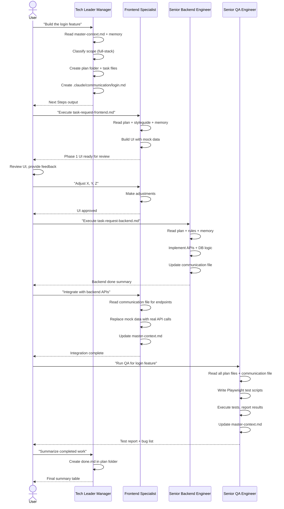
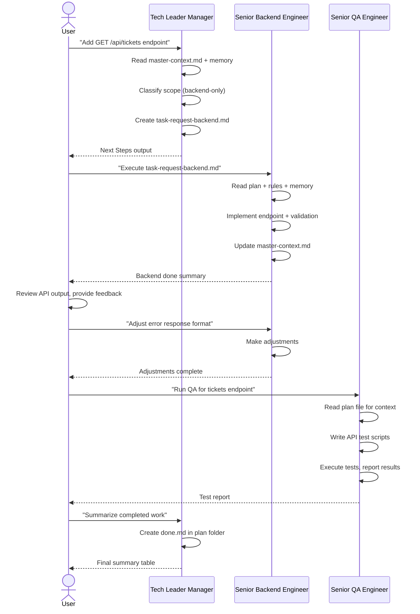
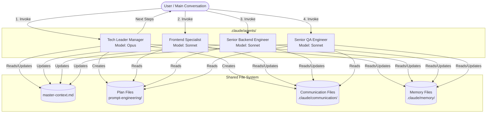
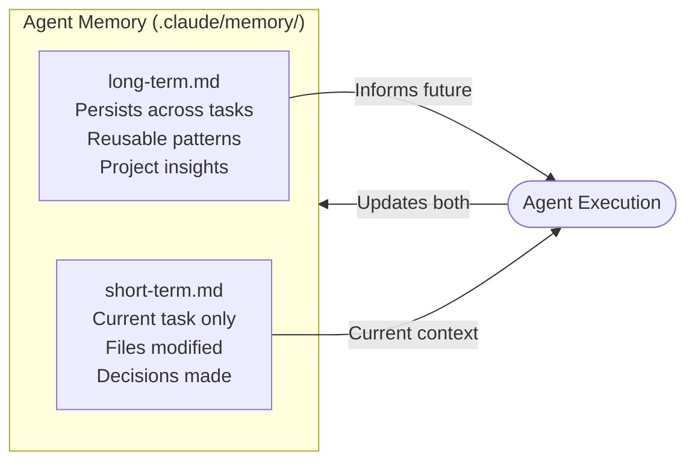
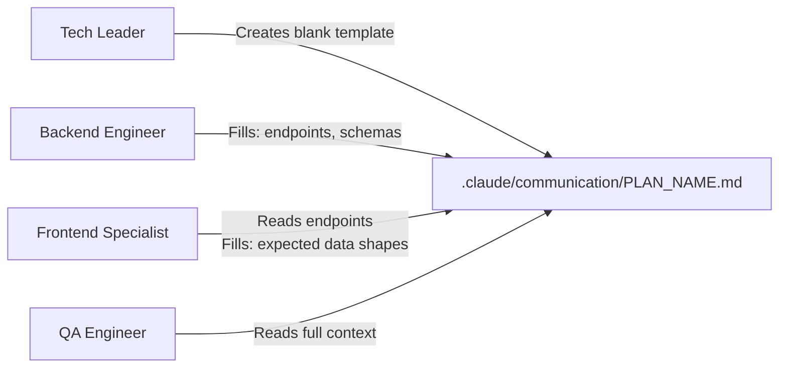
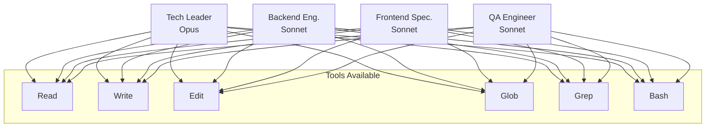

# AI Dream Team — Agents Architecture

This document describes the architecture of the AI Dream Team, a multi-agent system for executing full-stack development tasks on the ShinobiOps project.

---

## Overview

The AI Dream Team is composed of four specialized Claude subagents, each defined in `.claude/agents/`. They communicate through shared plan files and a communication file, coordinated by the **Tech Leader Manager**.

> **Key Constraint:** Claude subagents cannot spawn other subagents. The Tech Leader creates plan files and outputs explicit "Next Steps" — the main conversation (or user) chains the agent calls.

---

## Agent Roster

| Agent | File | Model | Role |
|-------|------|-------|------|
| Tech Leader Manager | `.claude/agents/tech-leader-manager.md` | Opus | Orchestrator, planner, coordinator |
| Senior Backend Engineer | `.claude/agents/senior-backend-engineer.md` | Sonnet | APIs, database, business logic |
| Frontend Specialist | `.claude/agents/frontend-specialist.md` | Sonnet | React UI, components, integration |
| Senior QA Engineer | `.claude/agents/senior-qa-engineer.md` | Sonnet | Automated tests, bug reporting |

---

## File System Communication

Agents share state through files on disk — not through direct calls.

```
.
├── .claude/
│   ├── agents/                          # Agent definition files
│   │   ├── tech-leader-manager.md
│   │   ├── senior-backend-engineer.md
│   │   ├── frontend-specialist.md
│   │   └── senior-qa-engineer.md
│   ├── communication/                   # Inter-agent shared state (multi-agent tasks)
│   │   └── PLAN_NAME.md                 # Status, backend→frontend contracts
│   └── memory/                          # Per-agent persistent memory
│       ├── tech-leader/
│       │   ├── long-term.md             # Reusable insights across tasks
│       │   └── short-term.md            # Current task context
│       ├── senior-backend/
│       │   ├── long-term.md
│       │   └── short-term.md
│       ├── frontend-specialist/
│       │   ├── long-term.md
│       │   └── short-term.md
│       └── senior-qa/
│           ├── long-term.md
│           └── short-term.md
│
└── ai-driven-project/
    ├── master-context.md                # Single source of truth — all agents read/update
    ├── rules/                           # Project conventions (all agents consult)
    └── prompt-engineering/
        └── PLAN_NAME/                   # One folder per task
            ├── task-request-backend.md  # Backend engineer's instructions
            ├── task-request-frontend.md # Frontend specialist's instructions
            └── done.md                  # Final summary (created by Tech Leader)
```

---

## Workflow: Full-Stack Task



---

## Workflow: Backend-Only Task



---

## Agent Interaction Model



---

## Memory Architecture

Each agent maintains two memory tiers:



| Memory File | Purpose | Lifespan |
|-------------|---------|----------|
| `long-term.md` | Reusable knowledge: component locations, API patterns, gotchas | Permanent — grows over time |
| `short-term.md` | Current task state: plan path, modified files, open questions | Reset each new task |

---

## Communication File Protocol

When a task involves both frontend and backend, the Tech Leader creates a communication file that agents use to share contracts:



**Communication file sections:**
- **Status** — checklist of agent completion status
- **Shared Context** — info both engineers need
- **Backend → Frontend** — API contracts (endpoints, request/response schemas)
- **Frontend → Backend** — UI data requirements

---

## Agent Capabilities



All agents have the same tool set. Differentiation comes from their system prompts, which encode specialized knowledge, workflows, and constraints.

---

## Design Principles

1. **File-based coordination** — No direct agent-to-agent calls. All state lives in files the agents can read and write independently.
2. **High-level plans only** — The Tech Leader writes *what* to build, never *how*. Implementation decisions belong to engineer agents.
3. **Memory-driven continuity** — Each agent accumulates knowledge over time, making them progressively better at the project's patterns.
4. **Progressive UI development** — Frontend always builds with mock data first, then integrates. This decouples UI review from backend readiness.
5. **QA as a gate** — No task is complete until the QA agent has run and reported. The `done.md` is only created after QA.
6. **Master context as single source of truth** — All agents update `ai-driven-project/master-context.md`, keeping it current for future tasks.

---

## Invocation Examples

```bash
# Start a full-stack task
"Use the tech-leader-manager agent to plan: Build the ticket creation form with backend API"

# Execute frontend phase
"Use the frontend-specialist agent: Execute the plan at ai-driven-project/prompt-engineering/20250405_ticket-form/task-request-frontend.md"

# Execute backend phase
"Use the senior-backend-engineer agent: Execute the plan at ai-driven-project/prompt-engineering/20250405_ticket-form/task-request-backend.md"

# Run QA
"Use the senior-qa-engineer agent: Run QA for the task at ai-driven-project/prompt-engineering/20250405_ticket-form/"

# Request final summary
"Use the tech-leader-manager agent to create the done.md for ai-driven-project/prompt-engineering/20250405_ticket-form/"
```
